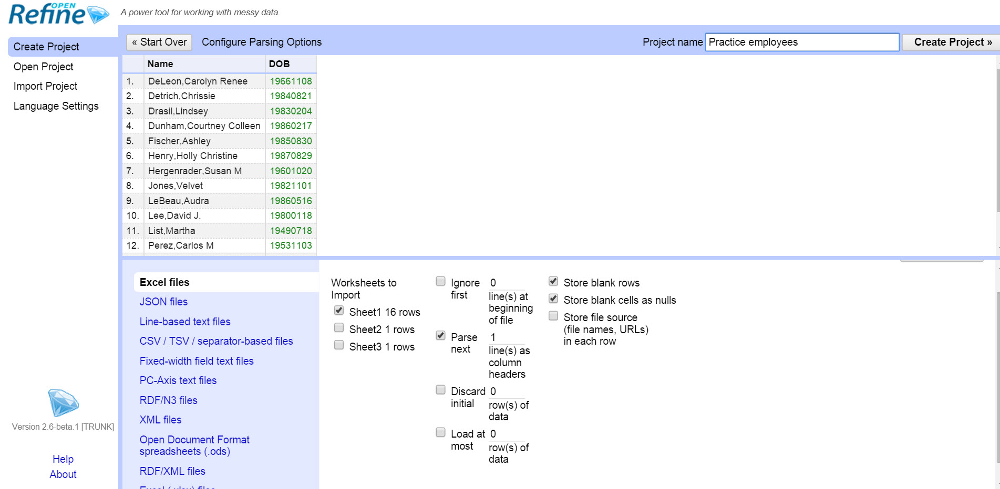
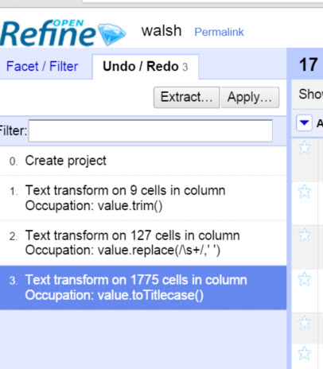

#Cleaning Data with Open Refine#
November 2014

## What's OpenRefine? ##
OpenRefine is used to make your data tidy when it's not. It can munge all kinds of files, transform your data, clean up messy company names and perform magic of all sorts. 

But as a volunteer-dependent open source product, it can crash and eat your work. Be careful about keeping your only copy of data in it.

##Getting started

Download the installation files from http://openrefine.org/download.html. I'm using the beta new version because of a few problems I was having, but either one is fine.  If you have trouble, take a look at the more detailed instructions at https://github.com/OpenRefine/OpenRefine/wiki

### Resources

* Paul Bradshaw's blog at [http://onlinejournalismblog.com/tag/googe-refine](http://onlinejournalismblog.com/tag/googe-refine). 
* *Using OpenRefine*, by Ruben Verborgh and Max De Wilde. It bills itself as the missing manual. Buy it from Packd or O'Reilly rather than Amazon to make sure you get an unrestricted copy you can use anywhere.
* Beginning tutorials on the [OpenRefine](http://openrefine.org/) site
* A whole list of tutorials and recipes on the OpenRefine wiki at https://github.com/OpenRefine/OpenRefine/wiki/External-Resources

We'll be working with some sample data donated by Maggie Mulvihill at Boston University. Her presentations are in this folder if you want to see how to get started. 

## Simple cleanup with OpenRefine

* Explore your data with facets
* Standardize names
 
### First look

Start OpenRefine and see.....nothing. 

Actually, you'll see something like this. 

Don't close that window even though you won't use it -- it's powering the application.

If you have a browser open, a new page should appear shortly. If not, a browser window should open. As a last resort, type this IP address into a browser: http://127.0.0.1:3333/

#### A tour of OpenRefine

The opening page lets you load a previously or start a new project. We'll do that.

For this, I'm using the file called employees.xlsx from the exampledata folder. 

This gives you a good sense of what Refine can handle - we'll go through the options in class. 

Always check your data when you import -- sometimes there are hiccups, especially when you choose to copy and paste into Refine. Make sure the number of rows is right and that there are no mystery columns.

The next step is to explore your data using facets, and split the names into two columns -- first name and last name -- based on the comma. Be sure to make a copy of the original column, or clear the option to remove the original.

Take a look at the date field, the amount field and the occupation field. Each are different types of data, so you'll get different windows.

Steps for cleaning: 

* Trim leading and trailing white space.
* Convert multiple spaces within text to just one
* Make them all the same case (I chose "title case". It won't always be what you want, but it will be consistent). 

Remember, a computer sees a space as a character, and upper case vs. lower case are different. Try to get the easy things done first. 

Take a look at the Undo/Redo tab -- it keeps track of everything you do, so if you want to re-do your work, you can just copy and paste. The language it's using is called GREL, which is short for "Google Refine Language," which was made up just for this project. (Google bought the project, then killed it. The founders keep it alive now as OpenRefine.)

### Cleaning up occupations 
Take a look at your occupations -- many are similar, but they're entered differently. Filter and clean Boston Police.

Now try clustering - go through the various ways you can cluster to see how each one works. (I generally go through the ones that work fastest and are incidentally very accurate -- few false matches -- first. Then I try the ones that take longer and have to be reviewed more carefully.)

## A start-to-finish example

OpenRefine can do a lot more. [Here is](cleanup_medicare.md) a real-world start-to-finish example of something we had to do at work. To give you a sense of scale, this took about 3 hours from start to finish. 

## Other things you can do with Refine

* Reshape data. Say you have a column for each month, but you want to do a pivot table by month. You need to turn it into a row. 
* Using the same language elements that are in Python, scrape specific elements from a web page. This is one way to dig into detail pages from links.
* Parse results from data APIs that return JSON or other formatted data.

HOWEVER, it's not good on large datasets of more than about 20,000 rows (depending on the power of your computer). Clustering very large datasets is difficult for any program -- it's doubly true here.
 
